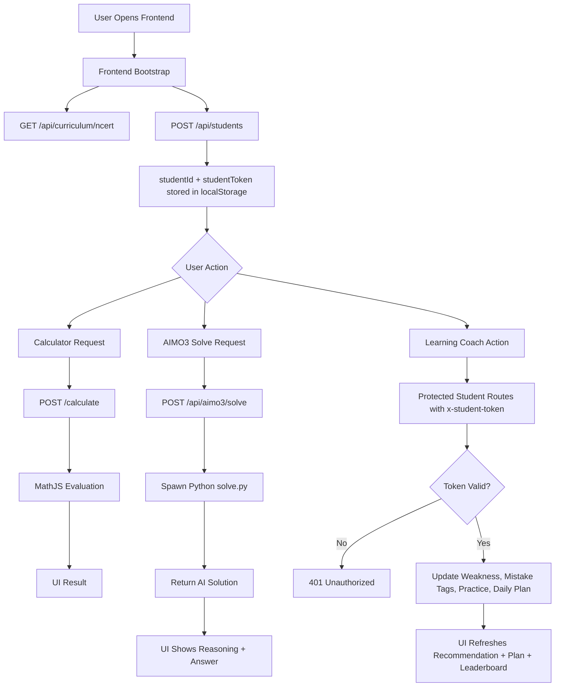
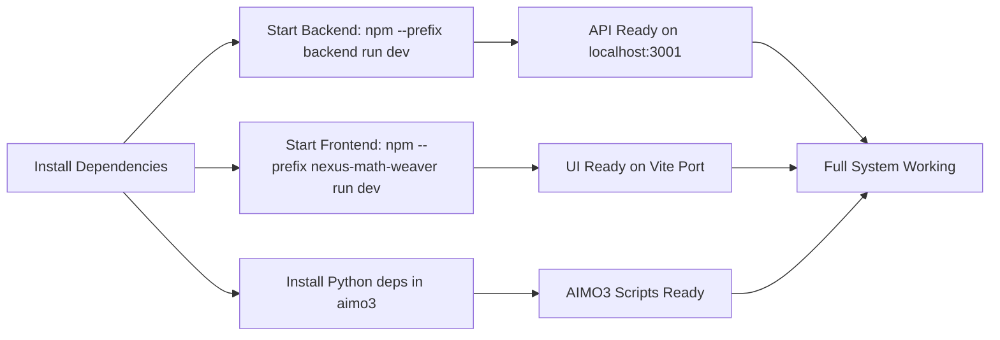

# NEXUS CALCULATOR - System Structure and End-to-End Flow

## 1. Project Structure

```
NEXUS CALCULATOR/
├── package.json                      # Root runner scripts
├── README.md                         # Main project docs
├── docs/
│   └── SYSTEM_FLOW.md                # This architecture and flow document
├── backend/                          # Node + Express API server
│   ├── server.ts                     # Main backend logic and routes
│   ├── data/
│   │   └── student_profiles.json     # Student profile persistence
│   └── package.json
├── nexus-math-weaver/                # React + Vite frontend app
│   ├── src/components/
│   │   ├── NexusLayout.tsx
│   │   ├── NexusLearningCoach.tsx
│   │   ├── AIMO3Solver.tsx
│   │   └── ...
│   └── package.json
└── aimo3/                            # Python training and solver pipeline
    ├── api/solve.py
    ├── data/
    ├── models/
    ├── training/
    └── requirements.txt
```

## 2. How It Works (Start to End)

### Stage A - Boot and Setup
1. Frontend starts on Vite dev server.
2. Backend starts on Express server (default port 3001).
3. Python environment in aimo3 is ready for solve and training scripts.

### Stage B - User Opens App
1. User opens frontend UI.
2. Frontend loads curriculum from backend endpoint /api/curriculum/ncert.
3. Frontend creates or restores a student profile using /api/students.
4. Backend returns studentId plus studentToken.
5. Frontend stores both values in localStorage.

### Stage C - Main Product Flows
1. Calculator flow:
- Frontend sends expression to /calculate.
- Backend evaluates with mathjs.
- Result returns to UI.

2. AIMO3 solve flow:
- Frontend sends problem to /api/aimo3/solve.
- Backend spawns Python process for aimo3/api/solve.py.
- Python returns solution payload.
- Backend returns parsed result to UI.

3. Learning coach flow:
- Frontend calls protected routes with x-student-token.
- Backend verifies student token against profile.
- Backend updates weakness, mistakes, plan, and recommendation.
- Frontend updates charting, practice set, and daily plan.

### Stage D - Improvement Loop
1. Student solves and verifies steps.
2. Backend logs attempts and mistake type per chapter.
3. Daily plan and recommendation adapt automatically.
4. Leaderboard and chapter mastery update.

## 3. Runtime Flowchart



## 4. Service Startup Flowchart



## 5. Perfect Working Checklist

1. Backend running with no port conflict on 3001.
2. Frontend running and connected to backend base URL.
3. aimo3 dependencies installed in active Python environment.
4. Student routes always called with x-student-token.
5. backend/data/student_profiles.json writable.
6. /api/curriculum/ncert file path resolves correctly.
7. Python command available in backend runtime path for solve route.

## 6. Recommended Daily Validation

1. Open app and create/restore student profile.
2. Run one calculator request.
3. Run one AIMO3 solve request.
4. Verify one coach step and check weakness update.
5. Load daily plan and leaderboard once.

If all five pass, the end-to-end system is healthy.

## 7. Answer-First UX Rule

1. Main Answer Panel is primary:
- Final answer
- Step-by-step reasoning
- Key formula used
- Mistake alerts

2. Visualization Panel is optional support:
- Equation transformation highlight
- Graph/shape/sketch only when useful
- Never replaces final answer surface

## 8. Score and Leaderboard Engine

1. Student session:
- Student logs in (optional OTP account) or continues as guest profile.
- Student ID + token protect profile updates.

2. Score accumulation:
- Calculator usage adds small points.
- Verified question-solving actions add points.
- Coach engagement adds points.
- Timed chapter challenge (10 questions) adds per-correct points.
- Perfect in-time challenge gives bonus points.

3. Leaderboard logic:
- Rank primarily by total score.
- Tie-break by overall accuracy, then attempt count.
- Heatmap still shows chapter mastery percent for diagnosis.

This creates a mastery loop:
Solve -> Diagnose Weak Chapter -> Practice 10-question timed challenge -> Gain score -> Climb leaderboard.

## 9. AI Solve Tiers and Auto Routing

1. Tier 1 (fast calculator engine):
- Simple calculations
- Basic arithmetic
- Algebraic simplification

2. Tier 2 (AI solver pipeline):
- Class 9 to 12 board-style questions
- NCERT conceptual and application questions

3. Tier 3 (AI solver pipeline, deeper budget):
- JEE foundation to advanced reasoning
- Olympiad-style non-routine problems
- Multi-step logic, number theory, geometry proof style

4. UI behavior:
- Answer panel shows detected tier
- Answer panel shows route used
- Answer panel shows estimated solve depth

## 10. Behavior-Driven Weakness Inference

1. Core engine uses behavior, not manual declaration:
- Student attempts chapter questions and step verification.
- System classifies outcomes like `correct-direction`, `formula-choice`, `sign-error`, `theorem-misuse`.

2. Chapter-wise storage:
- Attempts, correctness, and mistake-type frequency are stored chapter-wise.

3. Weakness scoring:
- Weakness score is computed from accuracy penalty plus mistake-frequency penalty.
- Highest weakness score is selected as current weakest chapter.

4. Optional self-marking:
- Student can mark a chapter as hard.
- This gives only a small nudge and does not replace behavior-driven ranking.
